<p align="center">
  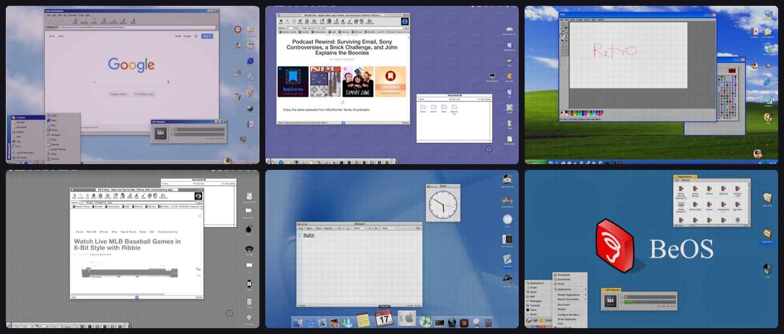
</p>

<h1 align="center">RetroMac</h1>

<p align="center"><b>Turn your Mac into a retro computer.</b><br>
A real-time CRT shader over your screen, and the desktops we grew up with on top of it:
Windows 95 to 7, System 6 to Snow Leopard, BeOS, OS/2, IRIX, NeXTSTEP. Boot screens,
screensavers, the games, and the crashes.</p>

<p align="center">
  <a href="https://github.com/klotzbrocken/RetroMac/releases"></a>
  <a href="https://github.com/klotzbrocken/RetroMac/releases"></a>
  <a href="https://myretromac.app"></a>
  <a href="LICENSE"></a>
  <a href="https://myretromac.app"></a>
</p>

<p align="center">
  <a href="https://github.com/klotzbrocken/RetroMac/releases/latest/download/RetroMac.dmg"><b>Download the DMG</b></a>
  &nbsp;·&nbsp; <a href="https://myretromac.app">myretromac.app</a>
  &nbsp;·&nbsp; <a href="CHANGELOG.md">What's new</a>
  &nbsp;·&nbsp; <a href="docs/THEMES.md">Make a theme</a>
</p>

<p align="center">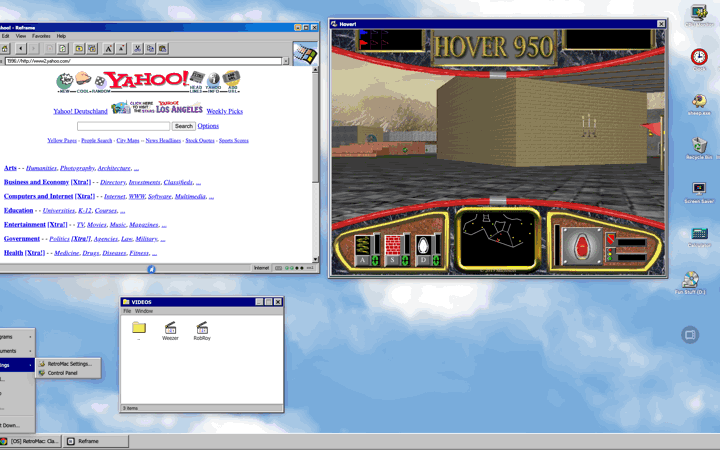</p>

## What it does

RetroMac is a menu-bar app with two ideas that work on their own or together:

1. **A CRT on your screen.** ScreenCaptureKit and Metal draw a click-through overlay and run
   shaders through it: curvature, scanlines, phosphor bloom, NTSC dot crawl, VHS tracking,
   Trinitron and PVM looks, the Game Boy's green. Over the whole screen, one display, one
   window, or the desktop only, with your application windows left sharp.

2. **A desktop from another decade.** A `.retromactheme` bundle brings its dock or taskbar,
   Start menu, wallpapers, icons, cursors, window chrome, boot screen and screensaver, and the
   toys of its era: Program Manager, the Control Strip, the Deskbar, Dashboard, Defrag, a Zip
   drive that clicks itself to death.

## A few impressions

| | | |
|:---:|:---:|:---:|
| 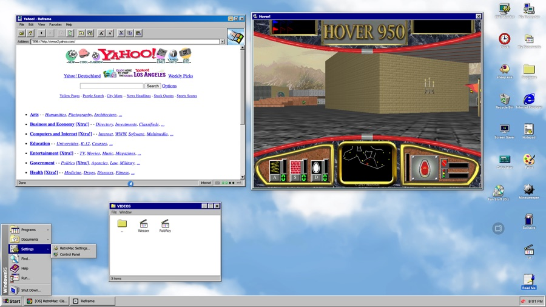<br>Windows 95 | 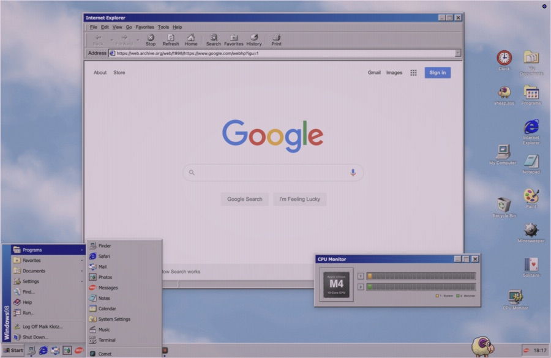<br>Windows 98 | 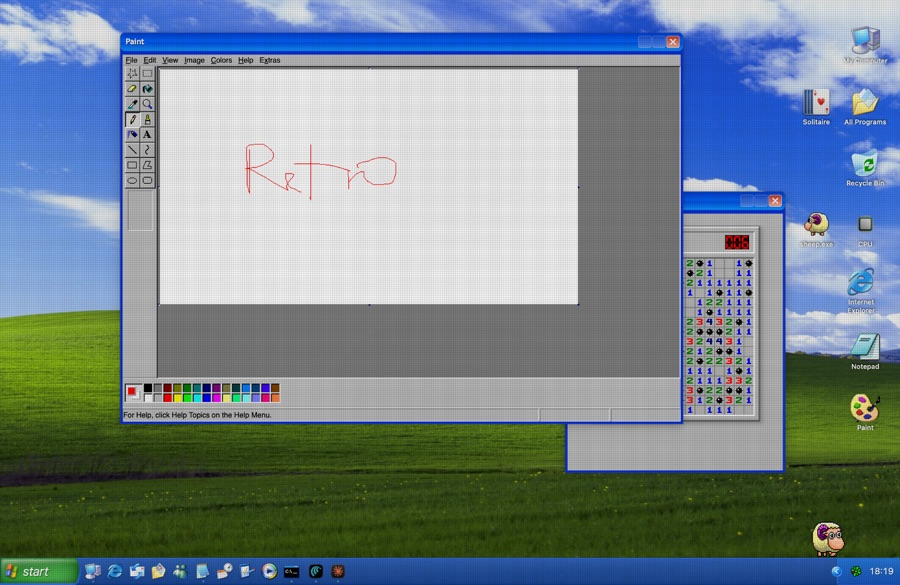<br>Windows XP |
| 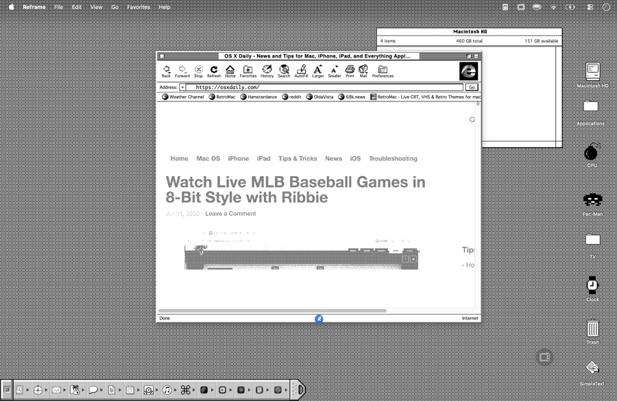<br>System 6 | 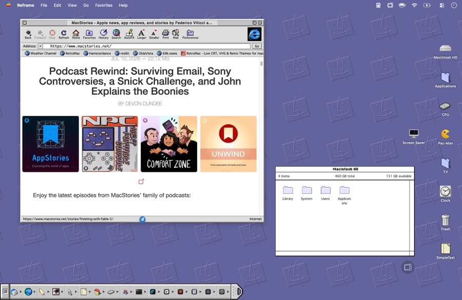<br>Mac OS 9 | 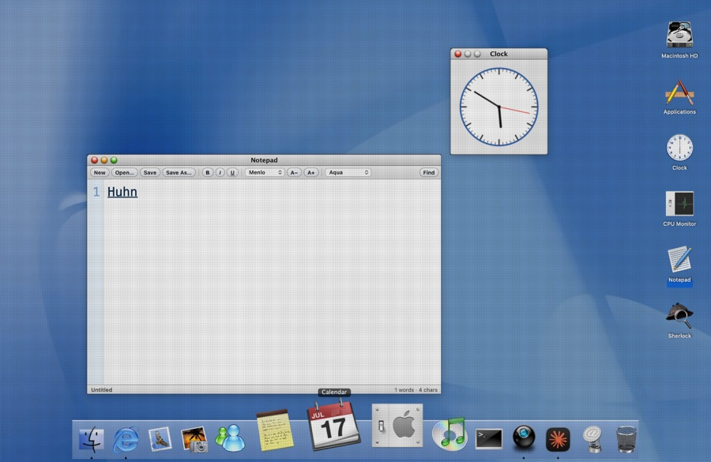<br>Mac OS X |
| 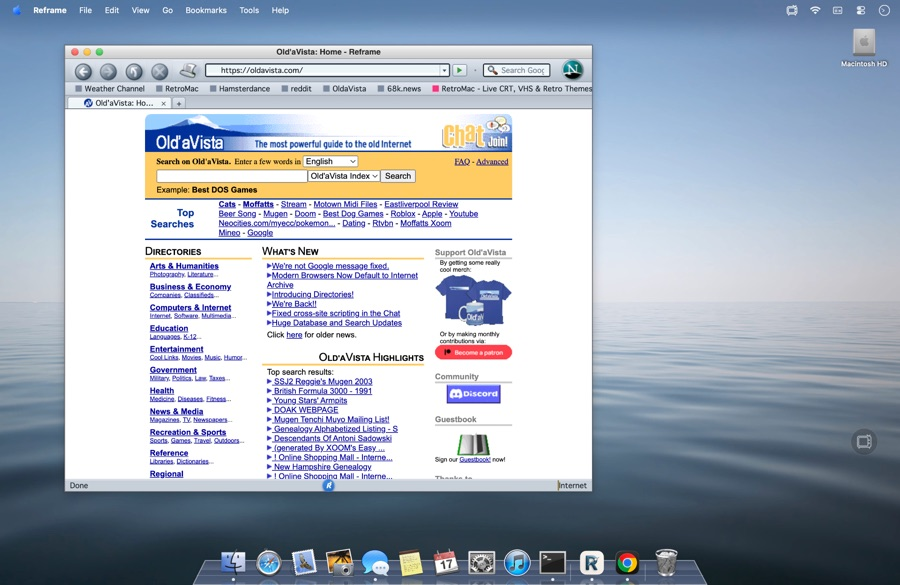<br>Snow Leopard | 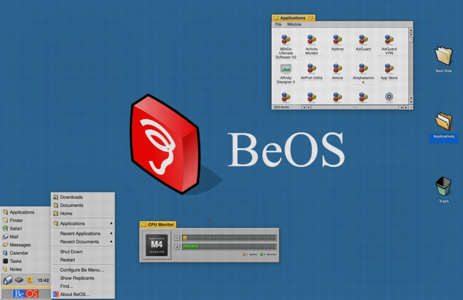<br>BeOS | 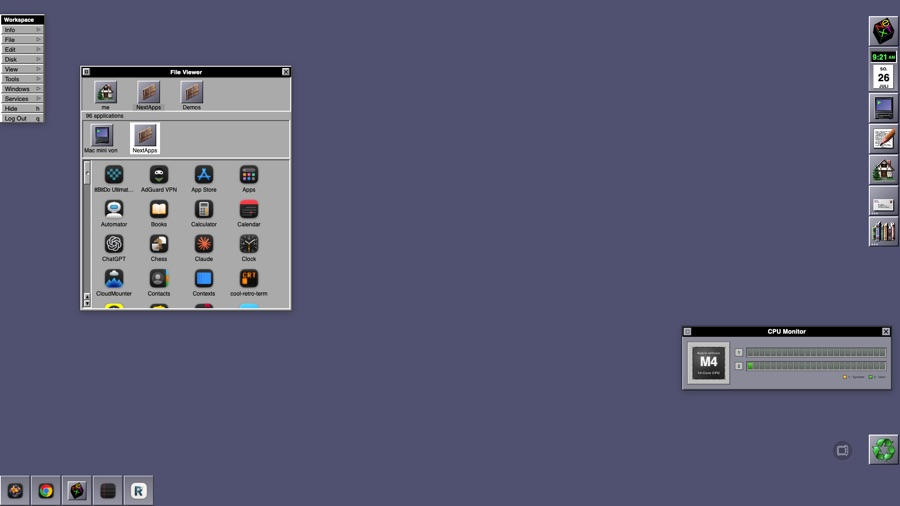<br>NeXTSTEP |
| 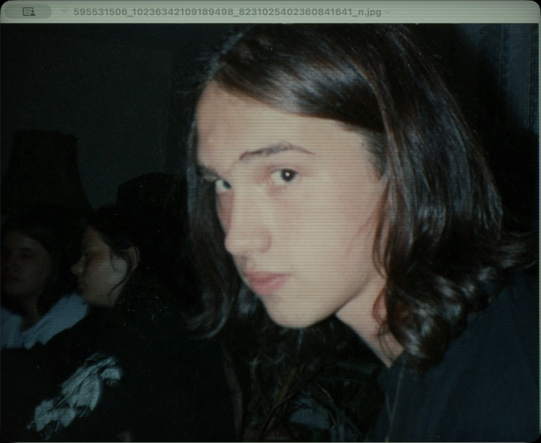<br>CRT Royale | 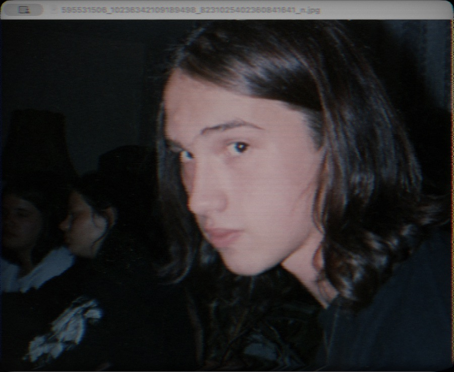<br>VHS | 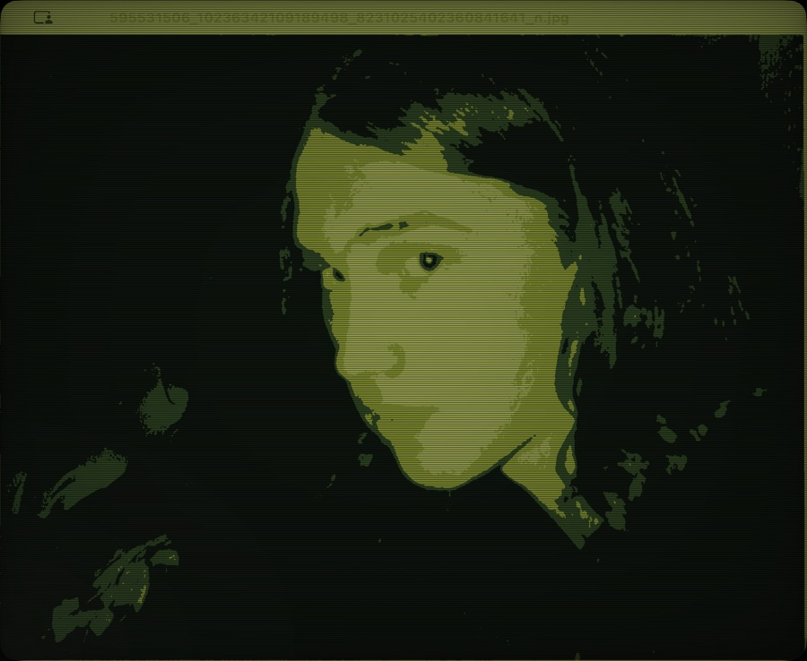<br>Game Boy |

More, and the videos, at [myretromac.app](https://myretromac.app).

## Features

- **Shaders** — thirty-odd presets (CRT Royale, GDV Mini Ultra, Lottes, zfast, Trinitron, PVM,
  LCD, VHS, VCR, NTSC composite, film) with intensity, vignette and bloom; per-app rules; your
  own Metal presets ([docs/CUSTOM-SHADERS.md](docs/CUSTOM-SHADERS.md)).
- **Live Wallpaper Plus** — the shader over wallpaper, desktop icons, dock and Start menu in one
  pass while your windows stay untouched. Nostalgia and work at the same time.
- **Themes** — Windows 3.1, 95, 98 (with the Plus! schemes), Me, XP, 7; System 6 (true 1-bit), System 7.1 (authentic: 256 colours, the 1994 Control Strip, the Application menu and the Apple menu),
  Mac OS 9 (and an authentic cut with the Control Strip of system modules and the Application
  menu instead of a dock), Mac OS X Cheetah, Mountain Lion, Snow Leopard; BeOS, OS/2 Warp 4,
  SGI IRIX, AmigaOS Workbench 4.1, NeXTSTEP, Futurama, and two of the maintainer's own.
- **Retro Dock and taskbar** — floats over or replaces the system Dock; Start menus in the 9x and
  Luna shapes, Quick Launch, tray with clock, speaker and messenger; per-window task buttons.
- **Cursors** — the theme's own pointer set, captured and restored exactly when the theme goes off.
- **Retro Crashes** — the failures of the period, none of them real: the 9x blue screen, Illegal
  Operation, the NT Stop error with memory dump, the bomb, the kernel panic, the Zip drive's
  click of death, boot failures after the simulated restart (NTLDR is missing, ScanDisk, CHKDSK,
  the Sad Mac, the update that will not finish), and small moments that pass on their own. No
  app is quit, no document closed, no restart issued. Esc always ends it.
- **Boot screens and screensavers** — each theme boots the way its machine did; Pipes, FlowerBox,
  Flying Toasters, Flurry and the Windows 2000 Starfield Simulation, also installable as real macOS savers.
- **Retro TV** — YouTube, IPTV streams and bookmarks inside a television with the CRT on.
- **Games** — Doom, Heretic, Quake, Quake II and Duke Nukem 3D through their free engines with
  the shareware episodes downloaded for you; Warcraft I and II on the bundled Stratagus engine
  with your own game data; an emulator installer and ROM library.
- **Virtual camera** — the shader on your webcam for Zoom, Meet, Teams and OBS.
- **Retro Mode** — one click sets theme and shader and hides the modern Mac; one click brings
  it all back. Health Check, wallpaper and Dock restore are built in.

The full history is in the [Changelog](CHANGELOG.md).

## Install

- macOS 14 (Sonoma) or later, Apple Silicon or Intel (the release is a universal binary).
- Download the signed, notarized DMG from the [Releases page](https://github.com/klotzbrocken/RetroMac/releases)
  or from [myretromac.app](https://myretromac.app), and drag RetroMac into `/Applications`.
- On first launch, grant **Screen Recording** (for the shader). **Accessibility** gives the
  taskbar a button per window instead of one per app; the virtual camera needs **Camera**.
  All three are optional, and Settings ▸ General shows what is missing.

RetroMac is **free to use**. An optional [Pro unlock](https://klotzzy2.gumroad.com/l/retromac-licence)
supports development and lifts the limits on premium themes and effects. No account, no
tracking, no subscription. Updates arrive through [Sparkle](https://sparkle-project.org/)
from the GitHub Releases feed.

## Build from source

```sh
git clone --recurse-submodules https://github.com/klotzbrocken/RetroMac.git
cd RetroMac
./build.sh debug      # local dev build, signed with a standard Apple Development identity
open "/Applications/RetroMac Dev.app"
```

- Requires the Xcode command-line toolchain (Swift 6, macOS 14 SDK).
- `./build.sh debug` uses reduced entitlements (no system-extension install) so it launches
  without a provisioning profile; the virtual camera is release-only.
- `./build.sh release` and `./package.sh` produce the signed, notarized DMG and need the
  maintainer's Developer ID certificate. Contributors use the debug build.
- The Warcraft engine lives in the `vendor/peonpad` submodule and is built on demand.

## Make your own theme

A theme is a folder with a `theme.json` and some pictures. [docs/THEMES.md](docs/THEMES.md)
describes every key, the desktop icon types, and how to test one. Settings ▸ Themes ▸ Advanced
imports it.

## Sandboxing, security, and whose artwork this is

RetroMac runs unsandboxed, which controlling the Dock, menu bar and system UI requires; it
ships with the Hardened Runtime, Developer-ID signed and notarized. [SECURITY.md](SECURITY.md)
has the security policy. [LEGAL.md](LEGAL.md) lists what in the app was written for it, what
is other people's free software, and what is the original artwork of the companies whose
desktops it recreates, and how to reach the maintainer about any of it.

## License

RetroMac is released under the [GNU GPL v3.0](LICENSE). The paid Pro unlock is an optional
way to support the project; the source remains free software.

## Support and links

- Website: [myretromac.app](https://myretromac.app)
- Buy me a coffee: [ko-fi.com/N4N11K1NC](https://ko-fi.com/N4N11K1NC)
- Sister app (skinnable email client): [Reframe](https://myretromac.app/reframe)
- Maintainer: [klotzbrocken.de](https://www.klotzbrocken.de)
